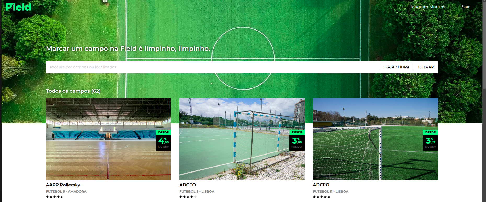
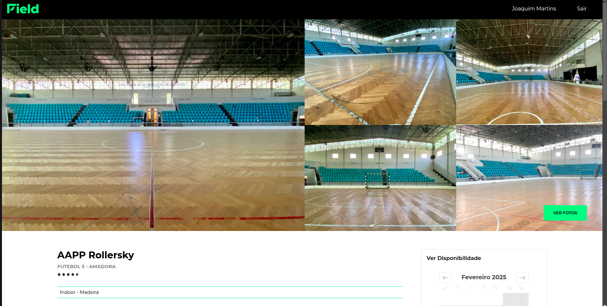
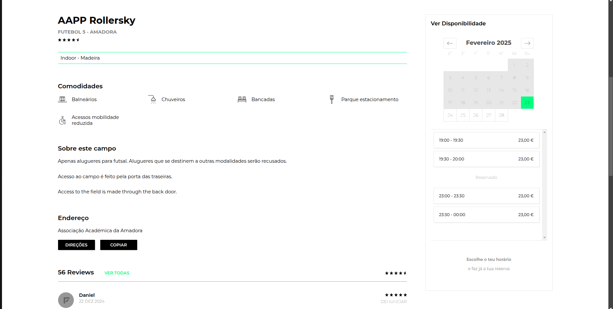

# Análise de Concorrente: Field
## Informações Gerais
- **Nome do Sistema:** Field
- **Empresa/Desenvolvedor:** FIELD MANAGEMENT TECHNOLOGY, LDA
- **Website/Página do Produto:** https://field.pt/
- **Versão/Data de Lançamento:** Abril de 2020 (última atualização)
- **Plataforma(s) Suportada(s):** WebApp, Aplicação Móvel (iOS, Android)
- **Público-Alvo:** Praticantes de desportos (Futsal, Futebol, Ténis, Padel, Squash)

---
## Funcionalidade Principal

**Objetivo Principal:** O Field é uma plataforma online destinada a facilitar a reserva de campos desportivos em Portugal, incluindo futebol, padel e ténis.

**Principais Funcionalidades:**
- Reserva online, é possível fazer a reserva online de um campo/pavilhão com pagamento por MBWay ou cartão de crédito.
- Indica a localização de cada campo/pavilhão.
- Fotos dos campos/pavilhões.
- Indica as comodidades que o respetivo campo/pavilhão tem (chuveiros, bancadas, Wi-Fi, Esplanada, etc.), bem como as regras do mesmo (não se pode fumar, não se pode usar pitons de alumínio). Tanto as comodidades como as regras estão adaptadas para cada campo.
- Conhecimento da possibilidade de cancelamento.

**O que torna o sistema único:**
-   Sistema que funciona no país inteiro incluindo, Madeira e os Açores

**Limitações/Pontos Fracos:**
- Não é possível dividir o pagamento.
- Não é possível reservar equipamento (raquetes, bolas, coletes, etc.) aquando a reserva do campo.
- Não é possível a reserva de parque de estacionamento.
- Falta de variedade de desportos.
- Falta de reservas periódicas.

---

## Capturas de Ecrã

## Avaliações Online
Cada campo/pavilhão tem reviews, então as reviews dependem do campo selecionado. 
Exemplo das reviews do campo AAPP Rollersky, Futebol de 5 na Amadora.

