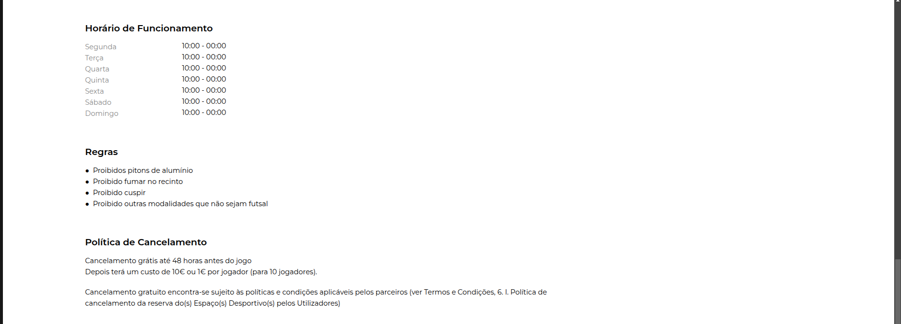

# Competitor Analysis: Field
## General Information
- **Name of System:** Field
- **Company/Developer:** FIELD MANAGEMENT TECHNOLOGY, LDA
- **Website/Product Page:** https://field.pt/
- **Version/Release Date:** April 2020 (last update)
- **Platform(s) Supported:** WebApp, Mobile Application (iOS, Android)
- **Target Audience:** Sports practitioners (Futsal, Football, Tennis, Padel, Squash)

---
## Core Functionality

**Primary Purpose:** Field is an online platform designed to facilitate the booking of sports fields in Portugal, including football, padel, and tennis.

**Key Features:**
- Online booking: Users can book a field/pavilion online and pay via MBWay or credit card.
- Displays the location of each field/pavilion.
- Provides photos of the fields/pavilions.
- Shows the available amenities (showers, stands, Wi-Fi, terrace, etc.) as well as field-specific rules (e.g., no smoking, no aluminum cleats).
- Information on cancellation policies.

**Unique Selling Points (USPs):**
- The system operates nationwide, including Madeira and the Azores.

**Limitations/Weaknesses:**
- Payment cannot be split.
- It is not possible to book equipment (rackets, balls, vests, etc.) when reserving a field.
- No option to reserve parking.
- Limited variety of sports.
- No option for recurring bookings.

---

## Screenshots

## Online Reviews
Each field/pavilion has its own reviews, so the ratings depend on the selected field.
Example of reviews for the AAPP Rollersky 5-a-side football field in Amadora:

