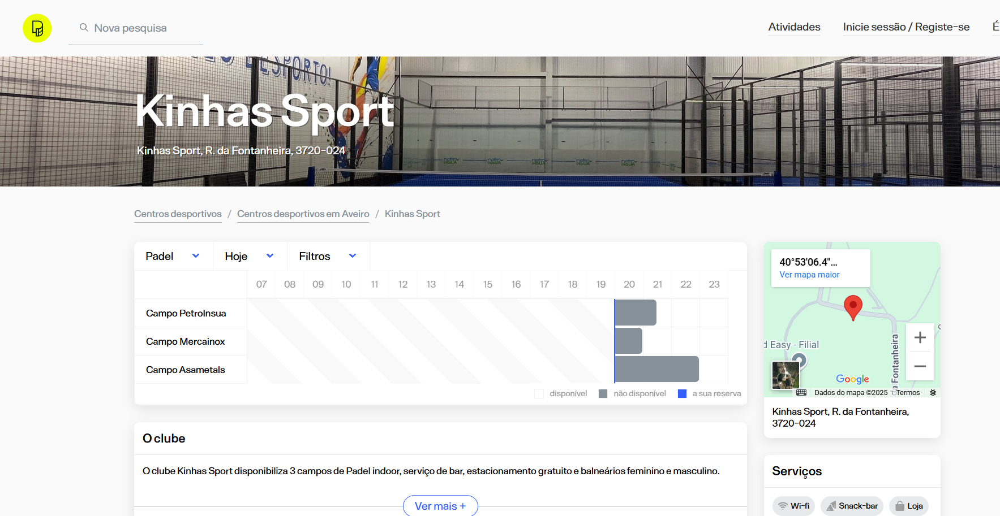

# Competitor Analysis: AirCourts
## General Information 
- **Name of System:**  AirCourts
- **Company/Developer:**  AirCourt
- **Website/Product Page:** https://www.aircourts.com/
- **Version/Release Date:** 2023
- **Platform(s) Supported:** WebApp, Mobile Application (iOS, Android)
- **Target Audience:** Sports practitioners 

--- 
## Core Functionality 

**Primary Purpose:** AirCourts is an online app plataform design to book fields to play sport.

**Key Features:** 
 - Live chat
 - Fields in very locations
 - Very easy to find help
 - Very variety of sports
 

**Unique Selling Points (USPs):** 
- Very locations including Angola
- Live chat

**Limitations/Weaknesses:** 
-  No option to reserve parking
-  No option to split costs

---

## Screenshots

## Online Reviews

